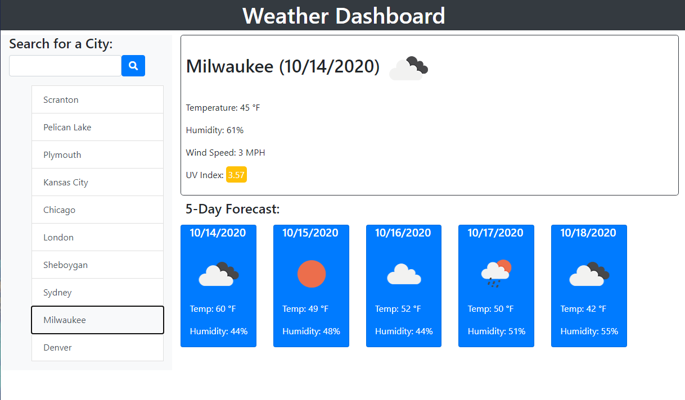

# Weather Dashboard

## Description of the Website
This is a website that provides the current weather, as well as a 5-Day Forecast for any city the user searches for.

 

## How it Works
* Enter in a city name into the search, or click on a previously searched city from the search history. Once a city has been chosen, the current weather and 5-day forecast will automatically populate.

 

## Website Features
* Current weather for the selected city that includes:
    * Current Date
    * Weather Icon
    * Temperature
    * Wind Speed
    * UV Index with low, moderate, and high color indicators
* 5-Day Forecast that includes
    * Date
    * Weather Icon
    * Temperature 
    * Humidity
* Local Storage to save search history of the past 10 searched cities
* Responsive layout for different sized screens
* Error handling for invalid city entries
  
 

## Link to Weather Dashboard
https://chriswein12.github.io/weather-dashboard/

 

## How the Website Looks

 

## Credits

* Project completed by Chris Wein*